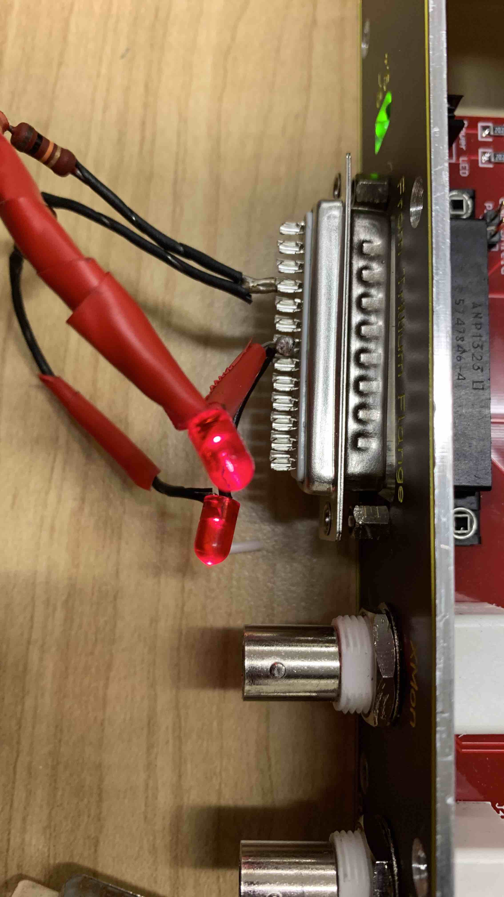

## PEM Box

### Trouble Shooting

1. Use a 25-pin tester to check +/- 18V signals in the chassis before we connect the chassis with the PEM box which contains the temperature.

Refer to [this diagram](./Connection.pdf) for details

If the pins are correct, then the LEDs should light. If it's reversed (e.g., ground pin 16 is actually INXL pin 23, which will go to temperature acromag), then the LEDs should not light. And if the temperature acromag is not disconnected, then there's chance that the current will exceed the limit in acromag and damage the unit.

Therefore, do _DISCONNECT_ the temperature acromag before connecting the tester.

