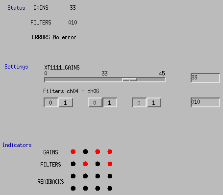

## Get started

### Preparation

0. Connect the power supply to XT1111
1. Connect XT1111 with Raspberry Pi via cat-5e cable
2. Connect XT1111 with the PC using USB cables if you want to check the readings from the client software in Windows at the same time (connect and select device, and start polling)
3. The i/o ports on xt1111 have four main sections:
   ch00 | ch01 | ch02 | ch03 ==> gains: 24dB | 12dB | 6dB | 3dB
   ch04 | ch05 | ch06 | ch07 ==> filters: f1 | f2 | f3 | on/off
   ch08 | ch09 | ch10 | ch11 ==> readbacks
   ch12 | ch13 | ch14 | ch15 ==> readbacks

### Run the scripts

0. Scripts are located at (logged in as user `controls`): `~/pythoncode/pitestcode/` or `/home/controls/pythoncode/pitestcode/`

1. Run `/bin/python /home/controls/pythoncode/pitestcode/xt1111_service.py` to start the service

2. Use `medm` to check out the interface

   - Use `Edit` button to rearrange and modify the settings for each component
   - Use `Execute` to interact with the interface

3. Interface `testscreen.adl` has three main sections:
   - Status: shows the `GAINS`, `FILTERS`, and `ERRORS` information of xt1111
   - Settings:
     - Use a slider to set the value for gains (0 to 45 with a step of 3). Or can input a value to set it (can raise error if input is out of range or not devisible by 3)
     - Use three choice buttons to toggle the status for each filter channel from filter 1 to 3. Or just type in the value to set it (1 for on and 0 for off, can raise error if it's not valid)
   - Indicators: show a visulization of all 16 ports which is very similar to the Windows client interface

### Current interface

08/12/2021: 

---
