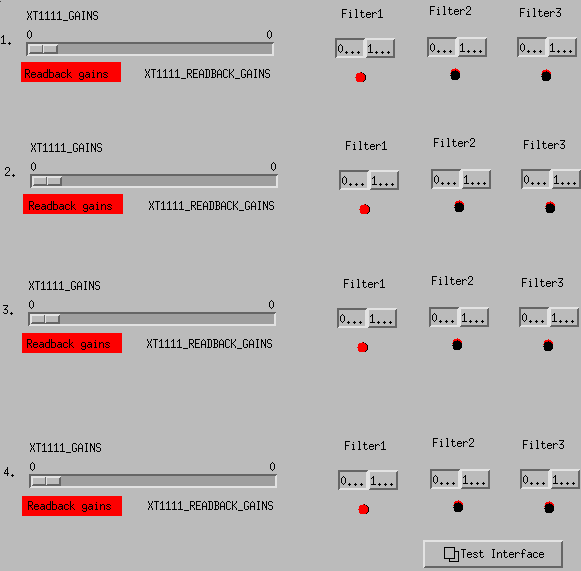

## Get started

### Preparation

0. Connect the power supply to XT1111
1. Connect XT1111 with Raspberry Pi via cat-5e cable
2. Connect XT1111 with the PC using USB cables if you want to check the readings from the client software in Windows at the same time (connect and select device, and start polling)
   - Check/Set the static IP address of the XT1111 (no direct linux setting solution yet): connect the device to Windown client, and use the ethernet setup screen to get and set the static IP address if you have multiple devices.
   - Note that the default address is `192.168.1.100`, to prevent conflictions, set other devices to be `192.168.1.x` (x != 0, 255, 100). After setting it up, the device infomation can show on the webpage if you type in the address. It's a one-time setup.
3. The i/o ports on xt1111 have four main sections:
   ```
   ch00 | ch01 | ch02 | ch03 ==> gains: 24dB | 12dB | 6dB | 3dB
   ch04 | ch05 | ch06 | ch07 ==> filters: f1 | f2 | f3 | on/off
   ch08 | ch09 | ch10 | ch11 ==> readbacks for gains
   ch12 | ch13 | ch14 | ch15 ==> readbacks for filters
   ```

### Run the scripts

0. Scripts are located at (logged in as user `controls`): `~/pythoncode/pitestcode/` or `/home/controls/pythoncode/pitestcode/`

1. Run `/bin/python /home/controls/pythoncode/pitestcode/xt1111_service.py` to start the service

2. Use `medm` to check out the interface

   - Use `Edit` button to rearrange and modify the settings for each component
     - MEDM reference: https://epics.anl.gov/EpicsDocumentation/ExtensionsManuals/MEDM/MEDM.html
   - Use `Execute` to interact with the interface

3. Interface `testscreen.adl` has three main sections (see [08/12/2021](#current-interface)):

   - Status: shows the `GAINS`, `FILTERS`, and `ERRORS` information of xt1111
   - Settings:
     - Use a slider to set the value for gains (0 to 45 with a step of 3). Or can input a value to set it (can raise error if input is out of range or not divisible by 3)
     - Use three choice buttons to toggle the status for each filter channel from filter 1 to 3. Or just type in the value to set it (1 for on and 0 for off, can raise error if it's not valid)
   - Indicators: show a visualization of all 16 ports which is very similar to the Windows client interface

4. Interface `xt1111.adl` are comprised of four acromag devices showing gain and filter settings for each (see [14/12/2021](#current-interface)).
   - Basically, you can slide to set the gains, and click to choose the filters.
   - You can bring up the `testscreen` by clicking the display button in the right bottom corner.

### Current interface

08/12/2021:


14/12/2021:



### Current Problems

1. For the slider bar, you need hold on to the mouse and release it only after you see the change in the indicators, to avoid it jump down: e.g., if you slide from 33 to 36, it often jumps back to 33 after you release the mouse, so if you slide a little further until you see the red/black indicators changes, then it would be OK. But if you slide from 36 to 33 there's no problem.
2. `ch07` on/off is not set correctly if we change anything other than the input textbox for filters. Other channels are not affected.
3. Readbacks are not updated correctly as shown in the Windown client interface.
4. New bug: clicking on the same filter choice button option twice would toggle the status again. Normally, if you click '0' (one or more times), it would turn or stay off, but in our case, if you keep again, it would toggle on.
5. Error messages when starting reading from readback channels

### Bugs Fixing Progress

1. Slider bar is a little clumsy to use.
2. [Fixed] Add the `enable` when starting xt1111 service.
3. [Fixed] Fix the read_registers string concatenation error.
4. [Fixed] Fix the filter buttons toggling back and forth problem.
5. [Fixed] Fix the error msg in medm startup.

---
