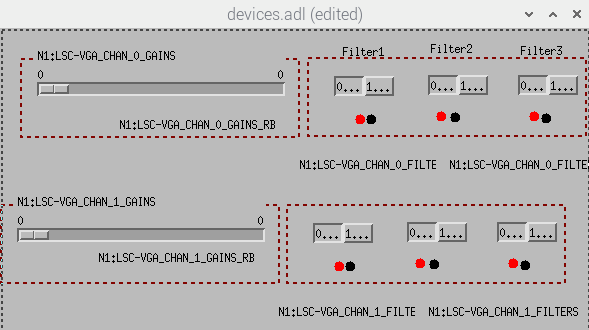

## RPI setup to use lsc vga control service

It uses up to 4 Acromag XT1111 devices to control the gains and filters, and read back the values.

For local testing purposes, refer to this [readme file](../../readme.md) for more details in prepartion and setting up environment, etc. Right now we are testing two of the units at the same time using this interface:



### Installation

> Assume now you're in the directory of `softioc` for the following `bash` commands.

There will be up to 4 directories, which are used as follows:

- **ini** -
  This hold the standalone_edc edc.ini file including the header details. If there is already a standalone_edc service running then you only have to manually copy the channel names into the excisting edc.ini file.

- **medm** -
  This holds the mdem interface file for the `lsc_vga_ctrl` service. Once the service starts, use `medm lsc_vga_ctrl/medm/devices.adl` to interact with the service via this interface.

- **python** -
  This hold the python implementations of the service. This can be based on the EPICS softIoc server or the python based pcaspy implementation. The remained of this installation instruction is based on the pcaspy SimpleServer implementation.

- **systemd** -
  This hold the files for installation of the python script to run and managed by the OS systemd service. This will help keep the python implementation operational.

```bash
# Installation
sudo cp lsc_vga_ctrl/systemd/lsc_vga_ctrl_service.service /etc/systemd/system/
#
# change the permission of the file to 644
sudo chmod 664 /etc/systemd/system/lsc_vga_ctrl_service.service
#
sudo mkdir /usr/local/lib/lsc_vga_ctrl_service
sudo cp lsc_vga_ctrl/python/lsc_vga_ctrl.py /usr/local/lib/lsc_vga_ctrl_service/lsc_vga_ctrl.py
sudo cp lsc_vga_ctrl/python/busworks.py /usr/local/lib/lsc_vga_ctrl_service/busworks.py
#
# make dir for lsc_vga_ctrl to store ini files, etc
mkdir -p /opt/rtcds/anu/n1/softioc/lsc_vga_ctrl/ini/
# change ownership of folder lsc_vga_ctrl to controls:controls to avoid permission denied problem if you create folder using sudo (root)
# sudo chown controls:controls /opt/rtcds/anu/n1/softioc/lsc_vga_ctrl/
#
# location of this file
# /etc/systemd/system/lsc_vga_ctrl_service.service
#
# enable with
sudo systemctl enable lsc_vga_ctrl_service.service
#
# start with
sudo systemctl start lsc_vga_ctrl_service.service
#
# check status with
sudo systemctl status lsc_vga_ctrl_service.service
```

### Recording the EPICS channels

The EPICS channels need to be obtained by the `standalone_edc` service on one of the front-end machines (`N1FE1` or `N1FE0`).

In the **ini** directory there is a file `lsc_vga_ctrl_ini_content.txt`. the content of the file needs to be copied into the `edc.ini` file for the `standalone_edc` service.

```
# Auto generated file by lsc_vga_ctrl.py
# at 2021-12-21 16:25:46
#
# Using the default parameters
[default]
gain=1.00
acquire=3
dcuid=52
ifoid=0
datatype=4
datarate=16
offset=0
slope=1.0
units=undef
#
#
# Following content lines to be manually added to the
# edc.ini file, which points to /opt/rtcds/anu/n1/chans/daq/N1FE1_EDC.ini
# Then the standalone_edc service (rts-edc.service on n1fe1) and the daqd
# service (rts-daqd.service on the n1fb10) will need to be restarted to
# the changes into effect.
#
[N1:LSC-VGA_CHAN_0_GAINS]
[N1:LSC-VGA_CHAN_0_FILTERS]
[N1:LSC-VGA_CHAN_0_GAINS_RB]
[N1:LSC-VGA_CHAN_0_FILTERS_RB]
[N1:LSC-VGA_CHAN_0_GAINS_ERROR]
[N1:LSC-VGA_CHAN_0_FILTERS_ERROR]
[N1:LSC-VGA_CHAN_0_FILTER04]
[N1:LSC-VGA_CHAN_0_FILTER05]
[N1:LSC-VGA_CHAN_0_FILTER06]
[N1:LSC-VGA_CHAN_1_GAINS]
[N1:LSC-VGA_CHAN_1_FILTERS]
[N1:LSC-VGA_CHAN_1_GAINS_RB]
[N1:LSC-VGA_CHAN_1_FILTERS_RB]
[N1:LSC-VGA_CHAN_1_GAINS_ERROR]
[N1:LSC-VGA_CHAN_1_FILTERS_ERROR]
[N1:LSC-VGA_CHAN_1_FILTER04]
[N1:LSC-VGA_CHAN_1_FILTER05]
[N1:LSC-VGA_CHAN_1_FILTER06]
[N1:LSC-VGA_CHAN_2_GAINS]
[N1:LSC-VGA_CHAN_2_FILTERS]
[N1:LSC-VGA_CHAN_2_GAINS_RB]
[N1:LSC-VGA_CHAN_2_FILTERS_RB]
[N1:LSC-VGA_CHAN_2_GAINS_ERROR]
[N1:LSC-VGA_CHAN_2_FILTERS_ERROR]
[N1:LSC-VGA_CHAN_2_FILTER04]
[N1:LSC-VGA_CHAN_2_FILTER05]
[N1:LSC-VGA_CHAN_2_FILTER06]
[N1:LSC-VGA_CHAN_3_GAINS]
[N1:LSC-VGA_CHAN_3_FILTERS]
[N1:LSC-VGA_CHAN_3_GAINS_RB]
[N1:LSC-VGA_CHAN_3_FILTERS_RB]
[N1:LSC-VGA_CHAN_3_GAINS_ERROR]
[N1:LSC-VGA_CHAN_3_FILTERS_ERROR]
[N1:LSC-VGA_CHAN_3_FILTER04]
[N1:LSC-VGA_CHAN_3_FILTER05]
[N1:LSC-VGA_CHAN_3_FILTER06]
```
