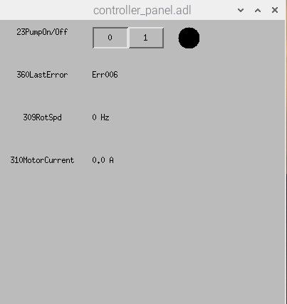

## TCM1601 Controller

### Quick start

1. Start the python service first in the terminal (`Accessories -> Terminal`):

```bash
python /home/controls/pythoncode/pitestcode/softioc/tcm1601_ctrl/python/vac_tne_service.py
```

2. Open and excute the medm interface, ignore the warning messages (due to network configuration):

```bash
medm -x /home/controls/pythoncode/pitestcode/softioc/tcm1601_ctrl/medm/controller_panel.adl
```

3. Things to do if there's an error
   1. Quit the python service by `Ctrl+C`
   2. Restart the service by `python /home/controls/pythoncode/pitestcode/softioc/tcm1601_ctrl/python/vac_tne_service.py`
   3. (Optional) Close the medm windows. Restart the medm interface by `medm -x /home/controls/pythoncode/pitestcode/softioc/tcm1601_ctrl/medm/controller_panel.adl`



### MEDM interface

1. Turn the pump on or off

2. Show the last error occured

3. Show the current rotation speed in Hz in read time (~.5s delay)

4. Show the motor current in A in real time (~.5s delay)

### Python service file

The python script is meant for the system service and the manual control of the medm interface to access data of the controller and the pump. (Will be improved by integrating it with the system service)

### Issues

1. The network configuration needs to be improved
   1. Get rid of unnecessary static addresses (which causes the medm service warnings)
   2. Configure the correct DNS to connect to the internet after rebooting
2. The service should start as the system service automatically after each rebooting of the system

### FAQ

### Reference

1. [TCM1601 Controller (Magnetic Bearing Controller)](https://www.ptb-sales.com/manuals/pfeiffer/tcm1601.pdf)
2. [RS232/485 Protocol for the controller](https://mmrc.caltech.edu/Vacuum/Pfeiffer%20Turbo/Pfeiffer%20Interface%20RS@32.pdf)
